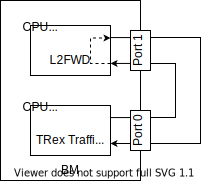
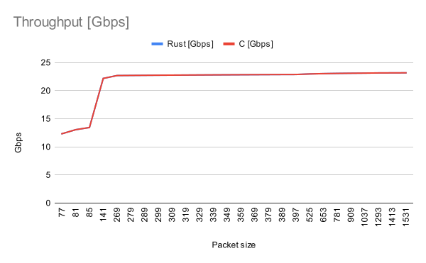
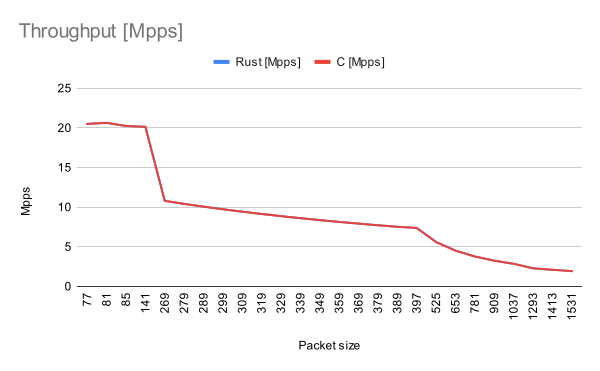
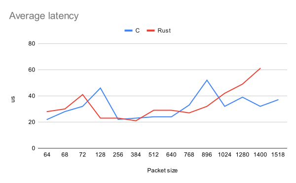
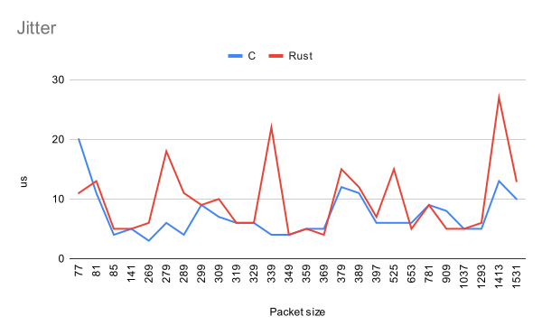
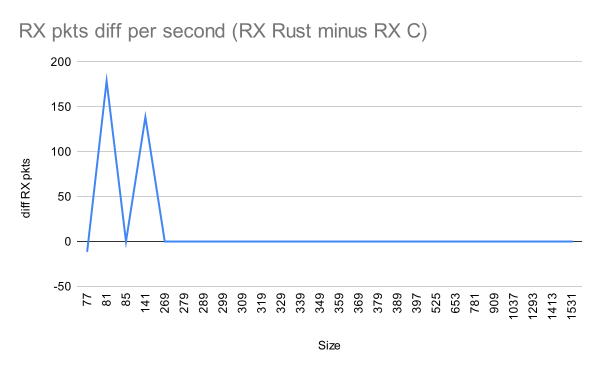

# Rust vs C: l2fwd results comparison

Performance comparison of [l2fwd written in C](https://github.com/DPDK/dpdk/blob/main/examples/l2fwd/main.c) and [l2fwd written in Rust](../l2fwd/src/main.rs).

## Environment description

We compared the performance of both applications in a one bare-metal environment with two Intel Xeon Gold 6252 CPUs. The l2fwd used one core of the first CPU (NUMA node 0) and the [TRex](https://codilime.com/a-traffic-generator-for-measuring-network-performance/) traffic generator used 16 cores of the other CPU (NUMA node 1). Both applications used memory local for their NUMA node so they didn't share the resources that could have some impact on performance (e.g. caches, memory). Also, l2fwd used a single interface of 25Gbps Intel's Ethernet Network Adapter XXV710 connected to NUMA node 0 and one RX and TX queue for traffic management. TRex used an NIC with one 25 Gbps interface connected to NUMA node 1.



Details about BM's CPUs:

```
lshw -class processor
  *-cpu:0
       description: CPU
       product: Intel(R) Xeon(R) Gold 6252 CPU @ 2.10GHz
       vendor: Intel Corp.
       vendor_id: GenuineIntel
       physical id: 13
       bus info: cpu@0
       version: Intel(R) Xeon(R) Gold 6252 CPU @ 2.10GHz
       slot: CPU0
       size: 3338MHz
       capacity: 4GHz
       width: 64 bits
       clock: 100MHz
       capabilities: lm fpu fpu_exception wp vme de pse tsc msr pae mce cx8 apic sep mtrr pge mca cmov pat pse36 clflush dts acpi mmx fxsr sse sse2 ss ht tm pbe syscall nx pdpe1gb rdtscp x86-64 constant_tsc art arch_perfmon pebs bts rep_good nopl xtopology nonstop_tsc aperfmperf eagerfpu pni pclmulqdq dtes64 monitor ds_cpl vmx smx est tm2 ssse3 sdbg fma cx16 xtpr pdcm pcid dca sse4_1 sse4_2 x2apic movbe popcnt tsc_deadline_timer aes xsave avx f16c rdrand lahf_lm abm 3dnowprefetch epb cat_l3 cdp_l3 invpcid_single intel_pt ssbd mba ibrs ibpb stibp ibrs_enhanced tpr_shadow vnmi flexpriority ept vpid fsgsbase tsc_adjust bmi1 hle avx2 smep bmi2 erms invpcid rtm cqm mpx rdt_a avx512f avx512dq rdseed adx smap clflushopt clwb avx512cd avx512bw avx512vl xsaveopt xsavec xgetbv1 cqm_llc cqm_occup_llc cqm_mbm_total cqm_mbm_local dtherm ida arat pln pts hwp hwp_act_window hwp_epp hwp_pkg_req pku ospke avx512_vnni md_clear spec_ctrl intel_stibp flush_l1d arch_capabilities cpufreq
       configuration: cores=24 enabledcores=24 threads=48
  *-cpu:1
       description: CPU
       product: Intel(R) Xeon(R) Gold 6252 CPU @ 2.10GHz
       vendor: Intel Corp.
       vendor_id: GenuineIntel
       physical id: c
       bus info: cpu@1
       version: Intel(R) Xeon(R) Gold 6252 CPU @ 2.10GHz
       slot: CPU1
       size: 3699MHz
       capacity: 4GHz
       width: 64 bits
       clock: 100MHz
       capabilities: lm fpu fpu_exception wp vme de pse tsc msr pae mce cx8 apic sep mtrr pge mca cmov pat pse36 clflush dts acpi mmx fxsr sse sse2 ss ht tm pbe syscall nx pdpe1gb rdtscp x86-64 constant_tsc art arch_perfmon pebs bts rep_good nopl xtopology nonstop_tsc aperfmperf eagerfpu pni pclmulqdq dtes64 monitor ds_cpl vmx smx est tm2 ssse3 sdbg fma cx16 xtpr pdcm pcid dca sse4_1 sse4_2 x2apic movbe popcnt tsc_deadline_timer aes xsave avx f16c rdrand lahf_lm abm 3dnowprefetch epb cat_l3 cdp_l3 invpcid_single intel_pt ssbd mba ibrs ibpb stibp ibrs_enhanced tpr_shadow vnmi flexpriority ept vpid fsgsbase tsc_adjust bmi1 hle avx2 smep bmi2 erms invpcid rtm cqm mpx rdt_a avx512f avx512dq rdseed adx smap clflushopt clwb avx512cd avx512bw avx512vl xsaveopt xsavec xgetbv1 cqm_llc cqm_occup_llc cqm_mbm_total cqm_mbm_local dtherm ida arat pln pts hwp hwp_act_window hwp_epp hwp_pkg_req pku ospke avx512_vnni md_clear spec_ctrl intel_stibp flush_l1d arch_capabilities cpufreq
       configuration: cores=24 enabledcores=24 threads=48
```

Generated traffic consisted of L2 packets with a single IPv4 and UDP headers with varying IP addresses and UDP ports. When testing bigger packet sizes, additional data was added at the end of the packet. For more details, refer to the [traffic description](traffic_desc.py).

While testing we also measured the core utilization. In the main function, l2fwd polls on the incoming packets in an infinite loop. Thanks to that we can achieve better performance compared to the traditional interrupt packet handling, but CPU usage is always around 100% so measuring the real core utilization is harder. We used a method described [here](https://software.intel.com/content/www/us/en/develop/documentation/vtune-cookbook/top/methodologies/core-utilization-in-dpdk-apps.html) to measure the CPU utilization.

Every loop, l2fwd tries to read at most 32 packets using `rte_eth_rx_burst()`. We can calculate the average number of packets received from these calls. If the average value is high, it means that in most loops l2fwd receives and processes some packets. On the other hand, if this value is low, this means that l2fwd mostly loops without doing any crucial work.


## Overload Test

The overload test consisted of sending as much traffic as we can, exceeding l2fwd's processing capabilities. In this case, we wanted to test software performance knowing that l2fwd would always have some work to do.

Note that the real sent packet sizes in the results consist of the packet data and additional 13 bytes added by TRex (preambule and IFG).

| Language | pkt size | real pkt size | test duration | TRex TX | TRex RX | l2fwd TX | l2fwd RX | l2fwd drops | Avg RX burst size |
|----------|----------|---------------|---------------|---------|---------|----------|----------|-------------|-------------------|
| C | 64 | 77 | 30 | 1116071337 | 650199801 | 650199801 | 1077181386 | 426981585 | 24.54 |
| Rust | 64 | 77 | 30 | 1116071337 | 647077942 | 647077942 | 911037787 | 263959845 | 32 |

We can see that Rust achieved worse results in this test. Rust l2fwd received around 1.2 less packets than C l2fwd and sent less packets. Also, we can see that the average RX burst is maximal (32) in case of Rust l2fwd and we achieved around 24.5 RX burst size in case of C l2fwd. This all means that C implementation is overall faster because it could process more packets.

Drop rate in both applications is very high. The most probable cause is that we used a single TX queue and it couldn't handle more packets.
It also explains why C implementation drop rate is higher than Rust. Both applications wanted to send more than TX queue could handle, but C was faster than Rust and tried to send more packets, which ultimately resulted in a bigger drop rate.

## RFC2544 results


<p float="left">
	
	
</p>
<p float="left">
	
	
</p>


### C detailed results

| size | real size | duration | pkt loss | tx pkts | rx pkts | tx bytes | latency avg | latency max | latency jitter | throughput bps | throughput pps |
|------|-----------|----------|----------|---------|---------|----------|-------------|-------------|----------------|----------------|----------------|
| 64   | 77   | 15 |  0  |  322613241 | 322613241 | 20647247424 | 106 | 164 | 11 | 12.33876723 | 20.51119747 |
| 68   | 81   | 15 |  0  |  324594250 | 324591124 | 22072409000 | 118 | 196 | 13 | 13.05931858 | 20.63694789 |
| 72   | 85   | 15 |  0  |  318442884 | 318442884 | 22927887648 | 19  | 142 | 5  | 13.44464478 | 20.24605331 |
| 128  | 141  | 15 |  0  |  316721427 | 316719348 | 40540342656 | 32  | 190 | 5  | 22.18158447 | 20.13647385 |
| 256  | 269  | 15 |  0  |  169835413 | 169835413 | 43477865728 | 35  | 186 | 6  | 22.69234563 | 10.79784476 |
| 266  | 279  | 15 |  0  |  163897061 | 163897061 | 43596618226 | 42  | 191 | 18 | 22.71298568 | 10.42029451 |
| 276  | 289  | 15 |  0  |  158359953 | 158359953 | 43707347028 | 36  | 289 | 11 | 22.73223123 | 10.06825466 |
| 286  | 299  | 15 |  0  |  153184751 | 153184751 | 43810838786 | 33  | 178 | 9  | 22.75021898 | 9.73922418  |
| 296  | 309  | 15 |  0  |  148337095 | 148337095 | 43907780120 | 37  | 179 | 10 | 22.76706813 | 9.431018511 |
| 306  | 319  | 15 |  0  |  143786844 | 143786844 | 43998774264 | 32  | 198 | 6  | 22.78288366 | 9.141721344 |
| 316  | 329  | 15 |  0  |  139507442 | 139507442 | 44084351672 | 36  | 181 | 6  | 22.79775759 | 8.869644292 |
| 326  | 339  | 15 |  0  |  135475407 | 135475407 | 44164982682 | 96  | 298 | 22 | 22.81177192 | 8.613294411 |
| 336  | 349  | 15 |  0  |  131669893 | 131669893 | 44241084048 | 34  | 183 | 4  | 22.82499902 | 8.371346347 |
| 346  | 359  | 15 |  0  |  128072331 | 128072331 | 44313026526 | 38  | 187 | 5  | 22.83750317 | 8.142619514 |
| 356  | 369  | 15 |  0  |  124666012 | 124666012 | 44381100272 | 32  | 284 | 4  | 22.84932058 | 7.926051585 |
| 366  | 379  | 15 |  0  |  121436305 | 121436305 | 44445687630 | 68  | 183 | 15 | 22.86054671 | 7.720712344 |
| 376  | 389  | 15 |  0  |  118369716 | 118369716 | 44507013216 | 41  | 192 | 12 | 22.87120597 | 7.525743866 |
| 384  | 397  | 15 |  0  |  116025688 | 116025688 | 44553864192 | 46  | 290 | 7  | 22.87934131 | 7.376714579 |
| 512  | 525  | 15 |  0  |  88109424  | 88109424  | 45112025088 | 40  | 192 | 15 | 22.97632277 | 5.601846313 |
| 640  | 653  | 15 |  0  |  71021231  | 71021231  | 45453587840 | 42  | 192 | 5  | 23.03563746 | 4.515408262 |
| 768  | 781  | 15 |  0  |  59484534  | 59484534  | 45684122112 | 40  | 181 | 9  | 23.07565066 | 3.78192482  |
| 896  | 909  | 15 |  0  |  51172089  | 51172089  | 45850191744 | 49  | 202 | 5  | 23.10446347 | 3.2534338   |
| 1024 | 1037 | 15 |  0  |  44897925  | 44897925  | 45975475200 | 77  | 346 | 5  | 23.12617909 | 2.854533195 |
| 1280 | 1293 | 15 |  0  |  36056192  | 36056192  | 46151925760 | 42  | 193 | 6  | 23.15673046 | 2.292390951 |
| 1400 | 1413 | 15 |  0  |  33009066  | 33009066  | 46212692400 | 99  | 249 | 27 | 23.16723777 | 2.098659897 |
| 1518 | 1531 | 15 |  0  |  30476395  | 30476395  | 46263167610 | 46  | 299 | 13 | 23.17595519 | 1.937637011 |

### Rust detailed results

| size | real size | duration | pkt loss | tx pkts | rx pkts | tx bytes | latency avg | latency max | latency jitter | throughput bps | throughput pps |
|------|-----------|----------|----------|---------|---------|----------|-------------|-------------|----------------|----------------|----------------|
| 64   | 77   | 15 | 0 | 322613241 | 322613085 | 20647247424 | 39  | 193 | 20 | 12.33876126 | 20.51118755 |
| 68   | 81   | 15 | 0 | 324594250 | 324593805 | 22072409000 | 119 | 172 | 11 | 13.05942645 | 20.63711834 |
| 72   | 85   | 15 | 0 | 318442884 | 318442884 | 22927887648 | 18  | 166 | 4  | 13.44464478 | 20.24605331 |
| 128  | 141  | 15 | 0 | 316721427 | 316721427 | 40540342656 | 40  | 195 | 5  | 22.18173008 | 20.13660603 |
| 256  | 269  | 15 | 0 | 169835413 | 169835413 | 43477865728 | 37  | 194 | 3  | 22.69234563 | 10.79784476 |
| 266  | 279  | 15 | 0 | 163897061 | 163897061 | 43596618226 | 43  | 192 | 6  | 22.71298568 | 10.42029451 |
| 276  | 289  | 15 | 0 | 158359953 | 158359953 | 43707347028 | 38  | 223 | 4  | 22.73223123 | 10.06825466 |
| 286  | 299  | 15 | 0 | 153184751 | 153184751 | 43810838786 | 43  | 184 | 9  | 22.75021898 | 9.73922418  |
| 296  | 309  | 15 | 0 | 148337095 | 148337095 | 43907780120 | 42  | 185 | 7  | 22.76706813 | 9.431018511 |
| 306  | 319  | 15 | 0 | 143786844 | 143786844 | 43998774264 | 32  | 224 | 6  | 22.78288366 | 9.141721344 |
| 316  | 329  | 15 | 0 | 139507442 | 139507442 | 44084351672 | 31  | 181 | 6  | 22.79775759 | 8.869644292 |
| 326  | 339  | 15 | 0 | 135475407 | 135475407 | 44164982682 | 37  | 182 | 4  | 22.81177192 | 8.613294411 |
| 336  | 349  | 15 | 0 | 131669893 | 131669893 | 44241084048 | 34  | 182 | 4  | 22.82499902 | 8.371346347 |
| 346  | 359  | 15 | 0 | 128072331 | 128072331 | 44313026526 | 35  | 188 | 5  | 22.83750317 | 8.142619514 |
| 356  | 369  | 15 | 0 | 124666012 | 124666012 | 44381100272 | 45  | 213 | 5  | 22.84932058 | 7.926051585 |
| 366  | 379  | 15 | 0 | 121436305 | 121436305 | 44445687630 | 45  | 187 | 12 | 22.86054671 | 7.720712344 |
| 376  | 389  | 15 | 0 | 118369716 | 118369716 | 44507013216 | 43  | 187 | 11 | 22.87120597 | 7.525743866 |
| 384  | 397  | 15 | 0 | 116025688 | 116025688 | 44553864192 | 36  | 216 | 6  | 22.87934131 | 7.376714579 |
| 512  | 525  | 15 | 0 | 88109424  | 88109424  | 45112025088 | 46  | 193 | 6  | 22.97632277 | 5.601846313 |
| 640  | 653  | 15 | 0 | 71021231  | 71021231  | 45453587840 | 51  | 216 | 6  | 23.03563746 | 4.515408262 |
| 768  | 781  | 15 | 0 | 59484534  | 59484534  | 45684122112 | 44  | 237 | 9  | 23.07565066 | 3.78192482  |
| 896  | 909  | 15 | 0 | 51172089  | 51172089  | 45850191744 | 59  | 219 | 8  | 23.10446347 | 3.2534338   |
| 1024 | 1037 | 15 | 0 | 44897925  | 44897925  | 45975475200 | 53  | 209 | 5  | 23.12617909 | 2.854533195 |
| 1280 | 1293 | 15 | 0 | 36056192  | 36056192  | 46151925760 | 54  | 209 | 5  | 23.15673046 | 2.292390951 |
| 1400 | 1413 | 15 | 0 | 33009066  | 33009066  | 46212692400 | 92  | 233 | 13 | 23.16723777 | 2.098659897 |
| 1518 | 1531 | 15 | 0 | 30476395  | 30476395  | 46263167610 | 64  | 225 | 10 | 23.17595519 | 1.937637011 |

## Conclusion

While testing, we noticed that the average number of packets per RX burst was always less than 2. This means that l2fwd was mainly idle during tests which explains why C and Rust results are so similar. In order to see more differences we should test it with more complex applications.

Also, in case of smaller packets, we couldn't achieve 25 Gbps, even though l2fwd was quite idle. The reason for that is a single RX and TX queue which couldn't handle the whole traffic.

We can also see that there were some tests in which Rust achieved better performance than C. We are not sure why Rust achieved better results when in an overload test it was clearly worse. We suspect it was caused by some slight code differences in both implementations that caused better packet handling in low load scenarios in Rust l2fwd.
